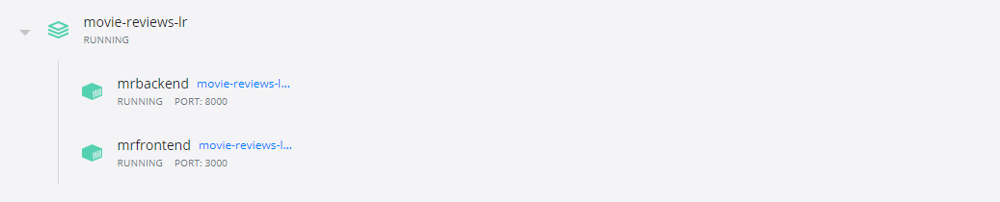

# Movie Reviews
End-to-end ML project using FastAPI, ReactJS, and Docker in a sentiment analysis context. Check out the [notebook](./backend/notebooks/movie_reviews_tfidf_lr.ipynb) to see how the ML model was built, the [backend](./backend) to see how the model was deployed and the [frontend](./frontend), if you want to learn how to consume APIs using ReactJS.

## Table of contents
- [Tech Stack](#tech-stack)
- [Repo Blocks](#repo-blocks)
- [Installation](#installation)
- [Demo](#demo)
## Tech Stack
- [x] FastAPI
- [x] ReactJS
- [x] Docker
## Repo blocks
```
movie-reviews-lr
   ├── assets
   │   └── ...
   ├── backend
   │   └── ...
   ├── frontend
   │   └── ...
   ├── docker-compose.yml
   └── README.txt
```
## Installation
* **_Clone it_**

Clone the repository then move to the project directory:
```
$ git clone https://github.com/zekaouinoureddine/movie-reviews-lr.git
$ cd movie-reviews-lr
```
* **_Dockerize it_**

Build the image and fire up the container:
```
$ docker-compose up -d --build
```
* **_Run it_**

To ensure if the app is running, open you favorite browser then go to [http://127.0.0.1:3000/](http://127.0.0.1:3000/). You should see something as shown in the demonstration section.



* **_Stop it_**

Before moving on, dont forget to Bring down the container:
```
$ docker-compose stop
```
## **Demo**
```
comming soon !
```

---
[BACK TO THE TOP](#movie-reviews)